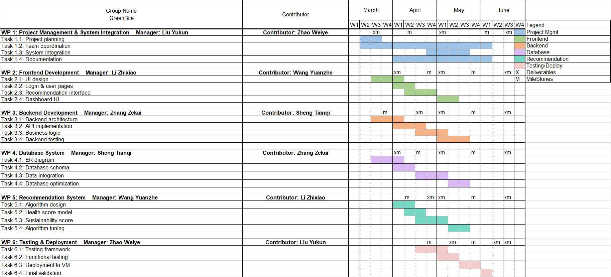

# Project Proposal
**GreenBite: A Sustainable and Healthy Meal Recommendation Platform for Corporate Cafeterias**

## 1. Project Overview
HachimiSoft is a software company focusing on enterprise digital solutions, dedicated to helping enterprises improve operational efficiency and achieve sustainable development through data-driven software systems. To help large enterprises optimize employee diet management and cafeteria operational efficiency, HachimiSoft proposes the GreenBite sustainable healthy meal recommendation platform, and targets the ByteDance corporate cafeteria as a potential client for product promotion.

As the scale of internet enterprises continues to expand, the operational complexity of corporate cafeterias is constantly increasing. Large tech companies typically have thousands or even tens of thousands of employees. With flexible working hours and scattered dining times, it is difficult for cafeterias to accurately predict daily demand. Meanwhile, different employees have diverse dietary preferences and health needs, such as fat loss, high protein, low calorie, or vegetarian diets, whereas traditional corporate cafeterias often lack personalized recommendation capabilities. Furthermore, an increasing number of employees tend to choose food delivery over dining in the cafeteria. This not only reduces the utilization rate of the cafeteria but may also lead to the intake of high-fat, high-salt, and high-calorie foods, negatively impacting employee health and increasing single-use packaging waste.

Based on these issues, the GreenBite platform aims to help the ByteDance cafeteria optimize operational efficiency, reduce food waste, and improve employee health conditions through intelligent meal recommendations, inventory management, and data analysis functions. GreenBite is not just a meal recommendation system, but a comprehensive solution supporting corporate cafeterias in achieving sustainable development and health management.

## 2. Problem Background and Client
As a large internet enterprise, ByteDance has a massive number of employees and provides corporate cafeteria services. However, due to the significant uncertainty in employee dining behaviors, the cafeteria finds it difficult to accurately predict daily meal demands. Traditional procurement methods usually rely on historical experience for judgment, which makes it difficult to cope with changes in employee demand. For example, on certain workdays, due to meetings, overtime, or remote work, some employees reduce their dining in the cafeteria, leading to the prepared ingredients not being fully utilized, thus generating food waste. At the same time, some popular meals may sell out early, affecting the employee experience and prompting them to turn to food delivery platforms.

Moreover, employees usually lack nutritional information references when selecting meals. Many employees wish to improve their dietary structure, such as choosing low-calorie or high-protein meals, but the cafeteria generally does not provide relevant data support. At the same time, cafeteria managers also find it challenging to analyze meal popularity or ingredient waste conditions. The lack of data support makes it difficult for the cafeteria to optimize procurement strategies, thereby increasing operational costs.

Therefore, the ByteDance cafeteria faces two main challenges: first, the difficulty in accurately predicting ingredient replenishment demands leads to waste; second, the high reliance of employees on food delivery affects their health and reduces the utilization rate of the cafeteria. HachimiSoft believes that the ByteDance cafeteria has excellent potential for digital upgrades and promotes GreenBite as the digital upgrade solution for the cafeteria.

## 3. Solution
The GreenBite platform will provide the ByteDance cafeteria with an intelligent meal recommendation and inventory management system. Employees can view the daily menu through the system and receive personalized recommendations based on their personal health goals, such as fat loss, high protein, or low-calorie meals. This approach can enhance the attractiveness of the cafeteria and reduce instances of employees ordering food delivery.

The system will also combine inventory data and historical dining data to prioritize recommending meals that use overstocked or near-expiry ingredients, thereby reducing food waste and optimizing ingredient utilization efficiency. Simultaneously, GreenBite will provide a data analysis dashboard, enabling cafeteria managers to view meal popularity, inventory usage, and waste risks, and to optimize procurement strategies based on data. In addition, the system will provide health tags, such as low-calorie or high-protein labels, to help employees select healthy meals more easily and encourage them to use the corporate cafeteria more frequently.

## 4. Technical Implementation
GreenBite will be implemented using React, Spring Boot, MyBatis, PostgreSQL, and Docker as its core technology stack. React is chosen for the frontend because its component-based development approach is suitable for building highly interactive Web interfaces, effectively supporting dynamic menu displays, personalized recommendation lists, user preference setting pages, and manager data dashboards. Additionally, React offers high development efficiency and good maintainability, making it easier for the team to expand and optimize interface functions later on.

For the backend, Spring Boot is selected because it is ideal for building RESTful Web services with clear structures and strong scalability. GreenBite needs to handle various business functions such as user requests, recommendation logic, inventory management, permission control, and data analysis. Spring Boot provides a mature development framework and rich ecosystem support, helping the team complete backend system development more efficiently while ensuring system stability and maintainability. Given the different roles in this project, such as regular employees, cafeteria staff, and administrators, Spring Boot also facilitates layered design and permission control implementation.

In the data access layer, the system will use MyBatis to implement interaction between the backend and the database. MyBatis is chosen because this project involves many business-critical database operations, such as meal queries, inventory updates, recommendation record management, and statistical analysis. Compared to relying entirely on auto-generated queries, MyBatis allows developers to control SQL statements more clearly, facilitating the implementation of complex query logic while improving the readability and maintainability of the data access layer. Thus, it is more suitable for this project's scenario with clear data structures and high query demands.

Regarding the database, GreenBite uses PostgreSQL to store user information, dietary preferences, meal data, inventory data, and statistical data. PostgreSQL is chosen because, as a mature relational database, it offers excellent stability and strong support for data consistency, capable of handling requirements like multi-table joins, statistical analysis, and structured data storage in this project. Furthermore, PostgreSQL's good support for complex queries makes it suitable for future meal recommendation analysis and operational data report generation.

In terms of system architecture, GreenBite adopts a frontend-backend separation model. The frontend React application accesses RESTful APIs provided by Spring Boot via HTTP requests, while the backend executes business logic and interacts with PostgreSQL through MyBatis. This architecture is chosen because it improves system modularity, allowing frontend development, backend development, and database design to proceed in parallel, thereby enhancing team collaboration efficiency and facilitating subsequent testing, maintenance, and functional expansion.

Additionally, to improve deployment consistency and portability, Docker will be introduced. Docker is selected because it can encapsulate the frontend, backend, and database environments into containers, reducing differences between various development environments and avoiding "it works on my machine" issues. For a course project, Docker also helps the team complete deployment, testing, and demonstration more conveniently in the university-provided virtual machine environment, improving project delivery efficiency.

## 5. Sustainability Contribution and SDG Alignment
GreenBite enhances sustainability from two aspects: reducing food waste and promoting employee health. The system reduces ingredient waste through inventory-aware recommendations and optimizes procurement strategies via data analysis, thereby improving resource utilization efficiency. Concurrently, GreenBite encourages employees to choose healthier meals through health tags and personalized recommendations, reducing reliance on food delivery and lowering single-use packaging waste.

The GreenBite project is highly aligned with the United Nations Sustainable Development Goals SDG 3 (Good Health and Well-being) and SDG 12 (Responsible Consumption and Production). The system improves the dietary structure of employees through healthy meal recommendations, while simultaneously reducing food waste through inventory optimization, thereby enhancing the sustainable operational capacity of corporate cafeterias.

## 6. Ethical Issues and Social Impact
During the design process, GreenBite will heavily consider data privacy and algorithmic bias issues. The system will adhere to the principle of data minimization, collecting only the data necessary for the recommendation function, and will employ encrypted storage and role-based access control to protect user privacy. Meanwhile, the recommendation system will remain transparent and allow administrators to adjust recommendation weights to avoid algorithmic bias and encourage healthy dietary choices.

GreenBite will also generate a positive social impact. The system can help employees form healthy dietary habits and improve corporate cafeteria operational efficiency, while reducing ingredient waste and single-use packaging waste. Additionally, implementing the GreenBite system can enhance the image of corporate social responsibility and promote sustainable enterprise development.

## 7. Expected Outcome
Upon project completion, HachimiSoft will provide the ByteDance cafeteria with a complete GreenBite platform, supporting personalized meal recommendations, inventory management, and data analysis functions. The system will be accessible via browsers, enabling employees to conveniently view meals and receive recommendations, while supporting managers in optimizing procurement strategies.

GreenBite is expected to reduce ingredient waste and increase cafeteria utilization rates, while simultaneously improving employee health conditions and reducing reliance on food delivery. Through a data-driven approach, GreenBite will help the ByteDance cafeteria achieve a more efficient and sustainable operational model and possesses the potential to be expanded to other corporate cafeterias or university cafeterias.

